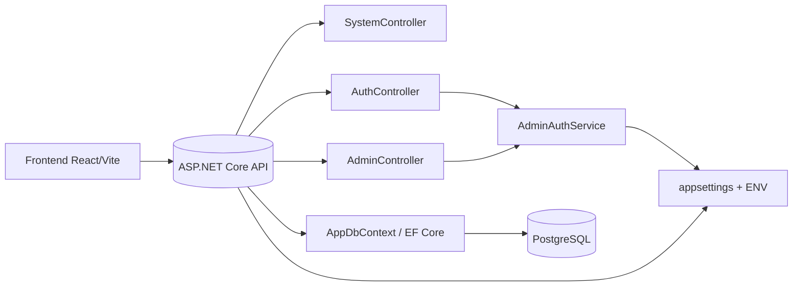
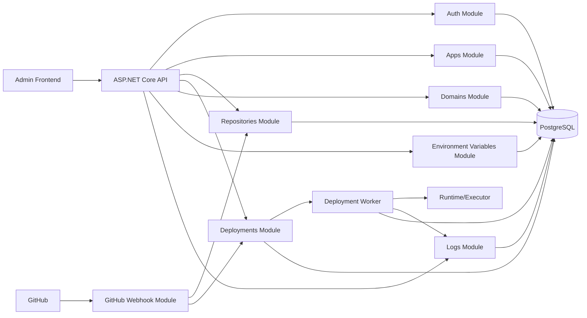
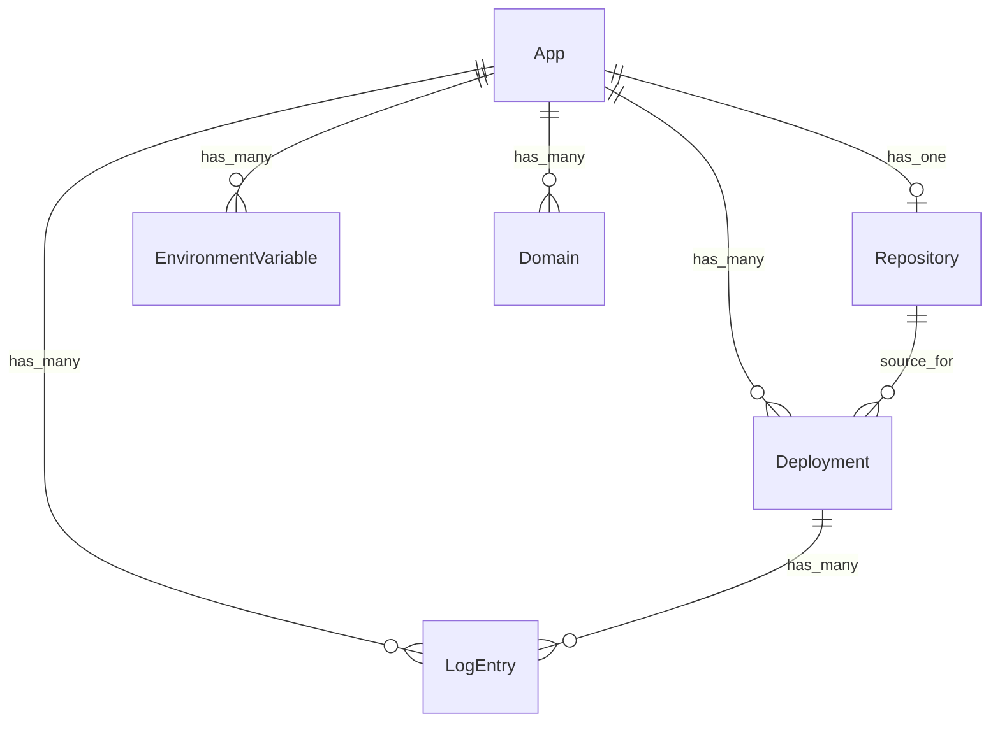

# paas-v0

Startowy projekt pod własny mini PaaS do hostowania aplikacji webowych.

## Struktura

- `frontend` — React + Vite
- `api` — ASP.NET Core Web API
- `infra` — konfiguracje infrastrukturalne (Docker, Traefik, deploy)

## Cel v0

Lokalne środowisko na Windows + WSL2 + Docker Desktop, które później będzie można przenieść na Ubuntu w Proxmox.

## Diagram architektury

Aktualny przepływ między frontendem, API i głównymi komponentami backendu:

Docelowy układ modułów wynikający z obecnego modelu domeny i planu backendu:

## Diagram relacji domenowych

Relacje encji zapisanych w bazie danych:

